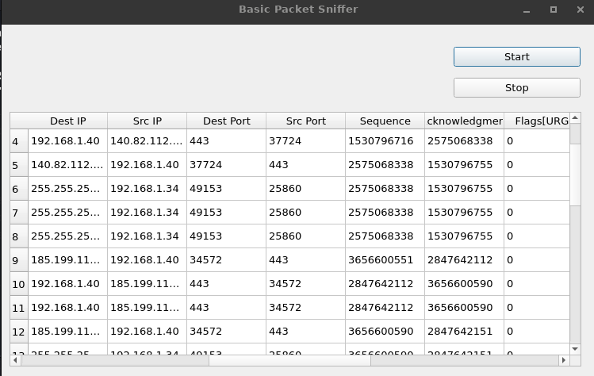

# CodeAlpha_Basic_Network_Sniffer
A network sniffer in Python that captures and analyzes network traffic. to better understand how data flows on anetwork and packets structure.
Basic Packet Sniffer

About:
Basic Packet Sniffer is a Python-based tool developed as part of the CODEALPHA Internship Tasks. It is designed to capture and analyze network traffic, providing detailed information for each packet, including:

    Ethernet Frame: Destination, Source, Protocol.
    IPv4 Packet: Version, Header Length, TTL, Protocol, Source, Target.
    TCP Segment: Source Port, Destination Port, Sequence, Acknowledgment, FLAGS[URG, ACK, PSH,RST, SYN, FIN] HTTP Data, TCP Data.
    ICMP Packet: Type, Code, Checksum, ICMP Data.
    UDP Segment: Source Port, Destination Port, Length.
    Ethernet Data.

Installation Steps and Requirements:
To install Basic Packet Sniffer, ensure you have Python 3.* installed on your system. Then, execute the following command in your terminal:

pip3 install -r requirements.txt

Interface : 

LinkedIn Profile:
https://www.linkedin.com/in/seyyid-taqy-eddine-oudjani-b964a5228/

Feel free to contact me for any inquiries or suggestions regarding Basic Packet Sniffer. Thank you for your interest!
